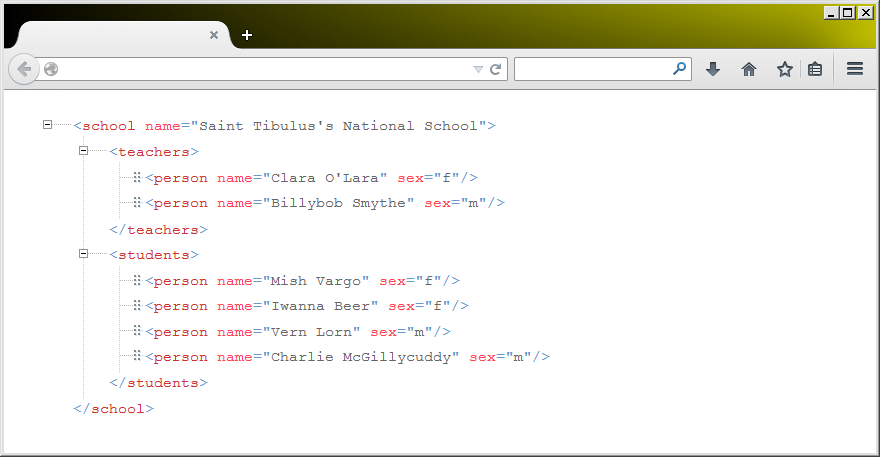
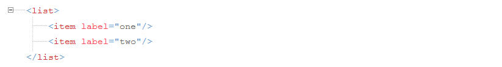
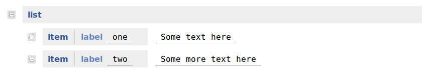
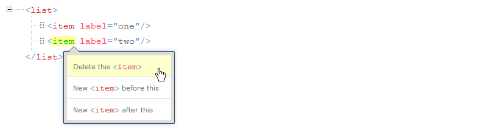

# Building XML Editing Applications with Xonomy

Michal Boleslav Měchura

_This document was last updated 3 April 2018._
_It applies to Xonomy version 3.5.0._

## Table of Contents one

- [0. Introducing Xonomy](#0-introducing-xonomy)
- [1. Quick-start guide](#1-quick-start-guide)
- [2. Controlling the structure of documents](#2-controlling-the-structure-of-documents)
- [3. Editing attribute values](#3-editing-attribute-values)
- [4. Controlling the contents of menus](#4-controlling-the-contents-of-menus)
- [5. Controlling the order of elements and attributes](#5-controlling-the-order-of-elements-and-attributes)
- [6. Dragging and dropping](#6-dragging-and-dropping)
- [7. Controlling the display of elements and their children](#7-controlling-the-display-of-elements-and-their-children)
- [8. Working with mixed content](#8-working-with-mixed-content)
- [9. Validating the document](#9-validating-the-document)
- [10. Working with surrogate objects](#10-working-with-surrogate-objects)
- [11. Working with namespaces](#11-working-with-namespaces)
- [12. Serving users multilingually](#12-serving-users-multilingually)
- [13. Using server-side data](#13-using-server-data)
- [14. Document specification reference](#14-document-specification-reference)
- [15. Minor and experimental features](#15-minor-and-experimental-features)

## Table of Contents

- [0. Introducing Xonomy](#0-introducing-xonomy)
  - [0.1. Who Xonomy is for](#01-who-xonomy-is-for)
  - [0.2. Xonomy’s vital statistics](#02-xonomys-vital-statistics)
  - [0.3. How this document is structured](#03-how-this-document-is-structured)
- [1. Quick-start guide](#1-quick-start-guide)
  - [1.1. Installing](#11-installing)
  - [1.2. Rendering](#12-rendering)
  - [1.3. Example](#13-example)
  - [1.4. Harvesting](#14-harvesting)
  - [1.5. ‘Nerd’ mode and ‘laic’ mode](#15-nerd-mode-and-laic-mode)
- [2. Controlling the structure of documents](#2-controlling-the-structure-of-documents)
  - [2.1. A gentle introduction to document specifications](#21-a-gentle-introduction-to-document-specifications)
  - [2.2. Example](#22-example)
- [3. Editing attribute values](#3-editing-attribute-values)
  - [3.1. `Xonomy.askString`](#31-xonomyaskstring)
  - [3.2. `Xonomy.askLongString`](#32-xonomyasklongstring)
  - [3.3. `Xonomy.askPicklist`](#33-xonomyaskpicklist)
  - [3.4. `Xonomy.askOpenPicklist`](#34-xonomyaskopenpicklist)
  - [3.5. `Xonomy.askRemote`](#35-xonomyaskremote)
  - [3.6. Writing your own asker functions](#36-writing-your-own-asker-functions)
  - [3.7. Treating element content like an attribute](#37-treating-element-content-like-an-attribute)
- [4. Controlling the contents of menus](#4-controlling-the-contents-of-menus)
  - [4.1. Captions](#41-captions)
  - [4.2. Actions and action parameters](#42-actions-and-action-parameters)
  - [4.3. Hiding menu items](#43-hiding-menu-items)
  - [4.4. Writing your own action functions](#44-writing-your-own-action-functions)
  - [4.5. Keyboard shortcuts](#45-keyboard-shortcuts)
- [5. Controlling the order of elements and attributes](#5-controlling-the-order-of-elements-and-attributes)
  - [5.1. Attribute order](#51-attribute-order)
  - [5.2. Child element order](#52-child-element-order)
- [6. Dragging and dropping](#6-dragging-and-dropping)
- [7. Controlling the display of elements and their children](#7-controlling-the-display-of-elements-and-their-children)
  - [7.1. Collapsing elements](#71-collapsing-elements)
  - [7.2. Oneliner display](#72-oneliner-display)
- [8. Working with mixed content](#8-working-with-mixed-content)
  - [8.1. Allowing mixed content](#81-allowing-mixed-content)
  - [8.2. Entering text at tag boundaries](#82-entering-text-at-tag-boundaries)
  - [8.3. Inserting inline markup](#83-inserting-inline-markup)
  - [8.4. Removing inline markup](#84-removing-inline-markup)
  - [8.5. `hasText` and `oneliner` as functions](#85-hastext-and-oneliner-as-functions)
- [9. Validating the document](#9-validating-the-document)
  - [9.1. Validating with recursion](#91-validating-with-recursion)
  - [9.2. Validating with delegation](#92-validating-with-delegation)
- [10. Working with surrogate objects](#10-working-with-surrogate-objects)
  - [10.1. The properties of a surrogate object](#101-the-properties-of-a-surrogate-object)
  - [10.2. Quick reference to surrogate objects](#102-quick-reference-to-surrogate-objects)
- [11. Working with namespaces](#11-working-with-namespaces)
  - [11.1. Namespaces in document specifications](#111-namespaces-in-document-specifications)
  - [11.2. Rendering with namespaces](#112-rendering-with-namespaces)
  - [11.3. Harvesting with namespaces](#113-harvesting-with-namespaces)
- [12. Serving users multilingually](#12-serving-users-multilingually)
  - [12.1. Multilingual strings](#121-multilingual-strings)
  - [12.2. Where can I use multilingual strings?](#122-where-can-i-use-multilingual-strings)
  - [12.3. Telling Xonomy which language to use](#123-telling-xonomy-which-language-to-use)
  - [12.4. Using multilingual strings in your own applications](#124-using-multilingual-strings-in-your-own-applications)
- [13. Using server-side data](#13-using-server-side-data)
  - [13.1. `Xonomy.askRemote`](#131-xonomyaskremote)
  - [13.2. Searching server-side data](#132-searching-server-side-data)
  - [13.3. Creating new server-side data](#133-creating-new-server-side-data)
  - [13.4. Adding items manually](#134-adding-items-manually)
  - [13.5. Getting captions and display values from the server](#135-getting-captions-and-display-values-from-the-server)
- [14. Document specification reference](#14-document-specification-reference)
  - [14.1. Document specification](#141-document-specification)
  - [14.2. Element specification](#142-element-specification)
  - [14.3. Attribute specification](#143-attribute-specification)
  - [14.4. Menu item specification](#144-menu-item-specification)
- [15. Minor and experimental features](#15-minor-and-experimental-features)
  - [15.1. Events](#151-events)
  - [15.2. Keyboard navigation](#152-keyboard-navigation)

---

## 0. Introducing Xonomy

Xonomy is a **web-based, schema-driven XML editor** written entirely in JavaScript and embeddable in any web page.
Xonomy emulates the look and feel of a text editor with syntax highlighting, code folding and autocompletion.
It is, however, not a text editor: you edit your XML documents by clicking on nodes, selecting options from context menus, selecting attribute values from picklists, dragging and dropping elements around, and so on.

You can customize Xonomy by giving it a document specification. A document specification is similar to a schema: it determines what actions the user can perform on each element, which attributes or child elements the user can create, where attribute values come from, and so on. This gives you a mechanism for constraining the structure of your XML documents which is roughly equivalent to a Document Type Definition (DTD). You can constrain your document further by attaching your own validation functions in JavaScript.

You supply a _document specification_ —a JavaScript object that constrains the structure of the document, defines menus and validation rules, and more. Xonomy works with both data-centric and document-centric XML, supports mixed content, namespaces, and multilingual interfaces.

Xonomy can handle both **data-centric** XML, which it displays in a tree structure, and **document-centric** XML, which is displayed as running text with inline XML markup. Xonomy is able to handle **mixed content** (elements which contain a mixture of text and elements) and has features for annotating text with inline XML. Xonomy can work with documents that use **namespaces**.



### 0.1. Who Xonomy is for

0.1. Who Xonomy is for
Xonomy isn’t a shrink-wrapped product for end-users. It is a UI component which software developers can use as a building block in their own applications. If you are building a web-based application where your users will need to edit XML documents (or any structured data that can be rendered as XML), then Xonomy will make your job a lot easier. You will no longer need to painstakingly handcraft a user interface for each document type. Instead, you can simply embed Xonomy in your HTML pages and write a few lines of JavaScript to provide a document specification. Xonomy will take care of all the remaining on-screen magic.

Xonomy is a **UI component** for developers. If your web application needs an XML (or structured-data-as-XML) editor, embedding Xonomy and writing a concise specification frees you from hand-crafting an interface for each schema.

### 0.2. How this document is structured

Chapters 1 – 2 are the must-read.

Chapters 3 – 11 cover specialised topics; chapter 14 is a reference; chapter 15 collects minor or experimental features.

Chapters 3 through to 11 = specialized topics and you can dip into them as and when you need.
Although, if you have the time and headspace available, it’s probably a good idea to read them all in sequence because they will expose you to Xonomy’s design principles: you will re-emerge at the end of chapter 13 with a good understanding of how Xonomy ‘ticks’.

Finally, chapter 14 is a reference to the properties of a document specification, so you can find them all in one place instead of having to fumble for them in the other chapters.

The last chapter is Chapter 15 which is a bit of catch-all basket for any remaining things that don’t fit neatly into any other chapter.

---

## 1. Quick-start guide

### 1.1. Installing

Download from <https://github.com/KCMertens/xonomy.git>, extract, and include `xonomy.js`, `xonomy.css`, or `xonomy.min.js` and `xonomy.min.css` in your page or download from npm <https://www.npmjs.com/package/@elexis-eu/xonomy>

In a bundled project (rollup, webpack, etc.) you can install the package and use it as a module.

```bash
npm install @elexis-eu/xonomy
```

```js
import Xonomy from "xonomy";

const x = new Xonomy();
// Now use x as you would normally.
```

In browser you can use the script tag to include the library.

```html
<link rel="stylesheet" href="dist/xonomy.css" />
<script src="dist/xonomy.umd.js"></script>
```

Import the Xonomy class and create an instance as follows:

```js
const x = new Xonomy();
```

### 1.2. Rendering

Call `x.render(xml, div, docSpec)` where `xml` is a string or `XMLDocument`, `div` is the container, and `docSpec` is your specification (or `null` for read-only).

### 1.3. Example

```html
<!DOCTYPE html>
<html>
  <head>
    <link rel="stylesheet" href="dist/xonomy.css" />
  </head>
  <body>
    <div id="editor"></div>
    <script type="module">
      import Xonomy from "./dist/xonomy.umd.js"; // Adjust the path as needed

      const x = new Xonomy();
      const xml = "<list><item label='one'/><item label='two'/></list>";
      x.render(xml, document.getElementById("editor"), null); // editor is id div where the editor will be rendered - adjust as needed
    </script>
  </body>
</html>
```

Output:


### 1.4. Harvesting

Use `x.harvest()` (no arguments) to retrieve XML as a string once editing is finished.

```js
function submit() {
  let xml = x.harvest(); //"<list><item label='one'/><item label='two'/></list>"
}
```

### 1.5. ‘Nerd’ mode and ‘laic’ mode

Toggle the visual style with `x.setMode('nerd')` or `x.setMode('laic')` at any time.

By default, Xonomy emulates the look and feel of XML source code, angle brackets and all. This is called
‘nerd’ mode. If you prefer (or rather, if your users prefer) you can switch Xonomy into something
called ‘laic’ mode which hides the XML code away and presents the document in a kind of structured
tree-view. This mode is intended for users who are not familiar with XML notation and do not find it
helpful.

```js
x.setMode("laic");
```

Output:


The two modes differ only in appearance: all functionality and all features are equally available in both. All remaining screenshots in this document will be in ‘nerd’ mode.

---

## 2. Controlling the structure of documents

### 2.1. A gentle introduction to document specifications

A document specification is a **JavaScript object** that describes elements, attributes, menus, validation, etc. If a tag or attribute isn’t listed, Xonomy creates a default read-only spec for it.

To tell Xonomy what it needs to know about the document your user is editing, you must give Xonomy a document specification. This is a JavaScript object which you supply to the function `x.render` as its third argument. (If that argument is `null`, Xonomy will construct a default document specification which will allow your users to look at the document but not edit it.) The basic skeleton of a document specification looks somewhat like this:

```js
const docSpec={
  elements: {
    myElement: {
      attributes: {
        myAttribute: {...},
        myOtherAttribute: {...}
      },
      ...
    },
    anotherElement: {
      attributes: {
        anotherAttribute: {...},
        yetAnotherAttribute: {...}
      },
      ...
    },
    ...
  },
  onchange: function () {
    ...
  },
  validate: function (obj) {
    ...
  },
};
```

Key optional functions:

- `onchange` – called whenever the document mutates. Use this to keep track of whether the document is ‘dirty’ (has been changed
  by the user since opening).
- `validate` – called after each change to push warnings. Use this to validate the document and to give feedback to your user in the form of warning messages. More about validation in chapter 9.

A document specification contains, among other things, a list of the element names that can occur in the document. Each element name comes with an element specification: a JavaScript object which tells Xonomy various facts about elements of that name: what actions the user can perform on them, how their content should be rendered, and so on.

In turn, an element specification contains a list of attribute names the element can have. Each attribute name comes with an attribute specification: a JavaScript object which tells Xonomy what it needs to know about attributes of that name: what actions the user can perform on them, how the user is supposed to edit their values, and so on.

#### 2.1.1 “What happens if the document contains an element or attribute that isn’t in the document specification?”

_**Nothing terrible will happen in that situation. In Xonomy, a document specification does not have to be ‘complete’: it does not need to contain the names of all and any elements and attributes that occur in the document. If Xonomy comes across an element or attribute that cannot be found in the document specification, it will construct a default specification for it which will allow the user to look at the element/attribute but not do anything to it.**_

- `onchange` – called whenever the document mutates. Use this to keep track of whether the document is ‘dirty’ (has been changed
  by the user since opening).
- `validate` – called after each change to push warnings. Use this to validate the document and to give feedback to your user in the form of warning messages. More about validation in chapter 9.

### 2.2. Example

Let's now have a look at a working example that makes use of a document specification. We will use Xonomy to let our users edit a simple XML document. The document starts with the `<list>` root element, which may contain one or more `<item>` child elements and each `<item>` may optionally have a label attribute whose value is an arbitrary string of text.

#### Understanding the XML Structure

First, let's understand what we're building. We want to edit this simple XML:

```xml
<list>
  <item label="one"/>
  <item label="two"/>
</list>
```

The structure is:

- Root element: `<list>` (can contain multiple `<item>` elements). `<list>` elements serve as containers for `<item>` elements.
- Child elements: `<item>` (can have an optional label attribute). `<item>` elements are the content within those containers.

#### Document Specification (docSpec) Breakdown

The document specification is a JavaScript object that describes the structure of the document. It looks like this:

```js
export const docSpec = {
  // Called whenever the XML document changes
  onchange: function () {
    console.log("I have changed now");
  },

  // Called to validate the current document state
  validate: function (obj) {
    console.log("I am validating now");
  },

  // Defines behavior for each XML element type
  elements: {
    // Configuration for <list> elements
    list: {
      // Context menu items that appear when user right-clicks <list>
      menu: [
        {
          caption: "Append an <item>", // Text shown in menu
          action: x.newElementChild, // Function to call when clicked
          actionParameter: "<item/>", // XML to insert as child
        },
      ],
    },

    // Configuration for <item> elements
    item: {
      // Context menu items that appear when user right-clicks <item>
      menu: [
        {
          caption: 'Add @label="something"', // Menu text
          action: x.newAttribute, // Add attribute function
          actionParameter: { name: "label", value: "something" }, // Attribute details
          hideIf: function (jsElement) {
            // Hide menu item if condition is true
            return jsElement.hasAttribute("label"); // Hide if label already exists
          },
        },
        {
          caption: "Delete this <item>", // Menu text
          action: x.deleteElement, // Delete current element
          // No actionParameter needed for delete
        },
        {
          caption: "New <item> before", // Menu text
          action: x.newElementBefore, // Insert sibling before current element
          actionParameter: "<item/>", // XML to insert
        },
        {
          caption: "New <item> after", // Menu text
          action: x.newElementAfter, // Insert sibling after current element
          actionParameter: "<item/>", // XML to insert
        },
      ],

      // Enable drag-and-drop: this element can be dropped into these parent elements
      canDropTo: ["list"],

      // Define attributes that this element can have
      attributes: {
        // Configuration for the "label" attribute
        label: {
          asker: x.askString, // How user edits attribute value (text input)
          menu: [
            // Context menu for the attribute itself
            {
              caption: "Delete this @label", // Menu text
              action: x.deleteAttribute, // Remove this attribute
            },
          ],
        },
      },
    },
  },
};
```

And the HTML page can look like this:

```html
<!DOCTYPE html>
<html>
  <head>
    <script type="text/javascript" src="dist/xonomy.umd.js"></script>
    <link type="text/css" rel="stylesheet" href="dist/xonomy.css" />
    <script type="text/javascript">
      function start() {
      let docSpec={...}; //insert docSpec here
      let xml="<list><item label='one'/><item label='two'/></list>";
      let editor=document.getElementById("editor");
      const x = new Xonomy();
      x.render(xml, editor, docSpec);
      }
      function submit() {
        let xml = x.harvest();
        //do something with xml...
      }
    </script>
  </head>
  <body onload="start()">
    <div id="editor"></div>
    <button onclick="submit()">Submit!</button>
  </body>
</html>
```

and the result will be:



Determining the root element:

`canDropTo` is absent from the `<list>` element specification. This means that the `<list>` element is the root element of the document.

`canDropTo` is a property that tells Xonomy that elements of this name can be dragged-and-dropped around i.e. it is a property that tells Xonomy that elements of this name can be dropped into these parent elements. Its value is an array of element names that can accept this element as a child. In this case the specification says that the `<item>` element can be dropped inside the `<list>` element. Try adding a few `<item>` elements to your document and then use the drag handle to drag them around. You will see that, while dragging, Xonomy shows you ‘drop anchors’ everywhere the element can be dropped.

`attributes` is a property that tells Xonomy that the element can have one attribute called `label`. The value is an attribute specification. The attribute specification says that the attribute has a menu with one item that allows the user to delete the attribute. Also, the attribute specification specifies how the user is expected to edit the attribute’s value. The `asker` property takes care of that. It refers to a funcion which ‘asks’ the user for a value. Here it refers to `x.askString`, a predefined asker function in Xonomy which affords editing the value as a short one-line string. Xonomy comes with several predefined asker functions. More details about asker functions, including instructions for writing your own, are explained in chapter 3.

Now, let’s read the document specification from top to bottom.

You see that the document specification is a JavaScript object (or map or dictionary or hash table or key-value store) with three keys:

- `onchange`
- `validate`
- `elements`.

You already know what the first two do. The most interesting is the third one, `elements`. It too is a JavaScript object where the keys are element names and the values are element specifications. You see that the document has two kinds of elements: `<list>` and `<item>`.

The `<list>` element specification is, again, a JavaScript object. This one contains only one key, menu, which specifies the menu that appears when the user clicks on the element. The value is an array of menu item specifications. A menu item specification is again a JavaScript object (this is getting boring!) with properties that specify what the menu item does and what its caption is. You will learn more about menus and menu item specifications in chapter 4.

The menu item in this example appends a new `<item>` child element to the `<list>` element when the user clicks it. The function `x.newElementChild` takes care of that, which is one of Xonomy’s predefined menu action functions. Menu action functions are explained in chapter 4, and you can also write your own.

The `<item>` element specification is a little richer.
Its menu has four items:

- one to add the label attribute (along with an initial value)
- two to add sibling `<item>` elements before and after
- one to delete the element.

Notice that the first menu item – the one that inserts the attribute – has a property called `hideIf`. This is a function which causes the menu item to be hidden if it returns true. Here, it causes the the menu item to be hidden if the element already has an attribute called label. The object passed to the function is an element surrogate object, a JavaScript object which encapsulates the current state of the element when the user clicked on it. Understanding surrogate objects is important if you want to write moderately complex document specifications, and they are explained in chapter 10. You will also see surrogate objects mentioned quite a lot before we even get to chapter 10.

The `<item>` element specification also has a `canDropTo` property (if it has a parent element and is not the root element). This tells Xonomy that elements of this name can be dragged-and-dropped around. Its value is an array of element names that can accept this element as a child. In this case the specification says that the `<item>` element can be dropped inside the `<list>` element. Try adding a few `<item>` elements to your document and then use the drag handle to drag them around. You will see that, while dragging, Xonomy shows you ‘drop anchors’ everywhere the element can be dropped.

Finally, the `<item>` element specification has an `attributes` property. This is a JavaScript object of the names of attributes the element can have. Here it says that the element can have one attribute called `label`. The value is an attribute specification. The attribute specification says that the attribute has a menu with one item that allows the user to delete the attribute. Also, the attribute specification specifies how the user is expected to edit the attribute’s value. The `asker` property takes care of that. It refers to a funcion which ‘asks’ the user for a value. Here it refers to `x.askString`, a predefined asker function in Xonomy which affords editing the value as a short one-line string. Xonomy comes with several predefined asker functions. More details about asker functions, including instructions for writing your own, are explained in chapter 3.

Well, congratulations, we’ve gotten to the end of this example! You now have a good idea of how Xonomy works. The rest of this document will delve deeper into some of the topics we touched above.

---

## 3. Editing attribute values

### 3.1. `Xonomy.askString`

---

## 3. Editing attribute values

### 3.1. `Xonomy.askString`
